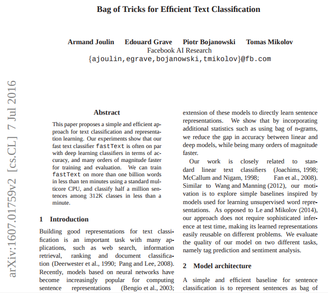

##
\centering
\small

## Paper
\centering
\large

### Goal

Speed up training models for Sentiment Analysis

### Key idea

Hashing of n-grams

## Hashing
**2-grams:** $(S_{t - 1} \cdot P_1)\ \text{mod}\ N$

**3-grams:** $(S_{t - 2} \cdot P_1 \cdot P_2 + S_{t - 1} \cdot P_1)\ \text{mod}\ N$

$t$: Current word

$S$: Vocabulary indices

$N$: Number of buckets in hashing vector

$P_n$: Large random prime number

## Vectors
**Hashing vector** $H = \begin{pmatrix}
0 \\
1 \\
\vdots \\
1 \\
0\end{pmatrix}$

**Word vector** $W_1 =
\begin{pmatrix}
1 \\
0 \\
\vdots \\
0 \\
0\end{pmatrix}$ $W_2 =
\begin{pmatrix}
0 \\
1 \\
\vdots \\
0 \\
1\end{pmatrix}$

$|V|, |W_n| = |V|$ (vocabulary size)

**Operations for $W_n$:** concatenation, averaging

## Results
* **Epochs:** 5
* **Samples per Epoch:** 1000
* **CPU:** 2.6 GHz Intel Core i5

| OneHot | ContextHashes | **Time** | **Accuracy** |
|-------------|---------------------|---------------------|-------|-------|
| Concat | $\times$ | 529s | 67% |
| Avg | $\times$ | 39s | 68% |
| $\times$ | $\checkmark$ | 58s | 74% |
| Concat | $\checkmark$ | 567s | 73% |
| Avg | $\checkmark$ | 101s | 73% |

## Code
\centering
\large

**Available on GitHub**

\huge

[github.com/poliglot/fasttext](https://github.com/poliglot/fasttext)
